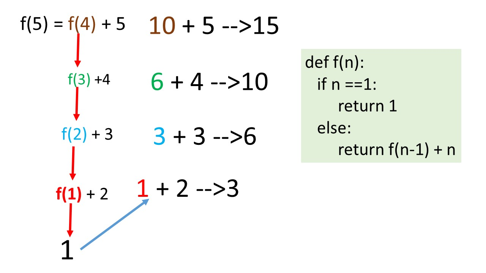

# f(n) = 1+2+3+....+n ==>  iterative vs recursive

- iterative
```python
def f(n):
   result = 0; 
   for i in range(n+1):
        result += i
   return result     

f(5)
# 1+2+3+4+5 = 15
```
- recursive:a defined function can call itself
  - f(n) = 1+2+3+...+(n-1)+n
  -      = f(n-1) + n
  - stopping conditopn:f(1) =1     
```python
def f(n):
   if n ==1:
     return 1
   else:
     return f(n-1) + n

f(5)
```

```
f(5) = f(4) +5
     -- >f(3) +4
       -- >f(2) + 3
         -- >f(1) + 2
           -- >1 + 2 =3
       -- >3 + 3 =6
     -- >6 + 4 =10
f(5) = 10 +5 = 15     
```


